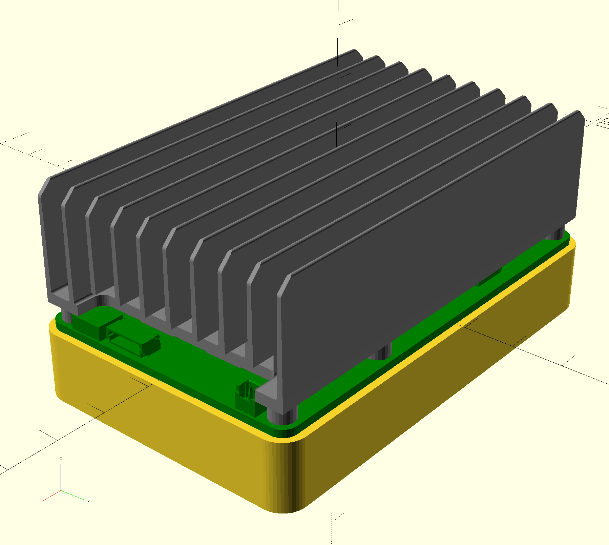

# UP Core Plus Antenna Base
a 3D printable base for the Aaeon UP Core Plus to mount WiFi antennas.
Can work with either stick-on flat internal antennas or external RP-SMA antennas. 
Also provides space to mount RTC battery and protects the bottom of the board.

## Notes
* To mount, use four to six M2.5 x 8 bolts, assuming the 9mm spacers that come with the board are used.
* The spacers fit snugly inside the case, so you can omit the bolts if you want; the case can be held on by friction.
* M2.6 bolts will not work; they will sort of go partway in, then jam (guess how I figured this out...)
* You need internal antennas and\or RP-SMA pigtails with the smaller MHF4 connectors, not (the more common) U.FL connectors.
* My STLs may have a built-in scale of 94.5% in x and y to correct for my own printer's calibration.  This can be easily adjusted in the OpenSCAD file.  If necessary, rescale for your printer when slicing or re-export the STL from OpenSCAD with a calibration factor suitable for your printer.

